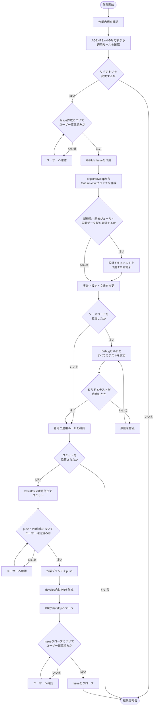

# エージェント向け開発ガイド

## プロジェクト概要

このリポジトリは、Pimoroni Tiny 2040（RP2040）を使用したUSB/DIN MIDIフットペダルのファームウェアです。

- 実装言語：C11
- ビルドシステム：CMakeおよびNinja
- SDK：Raspberry Pi Pico SDK 2.3.0
- RTOS：FreeRTOS Kernel V11.3.0（単一コア構成）
- 主な機能：フットスイッチ6個、EXPペダル1個、128 × 64 I2C OLED、RGB LED、プリセット保存、USB MIDI、DIN MIDI OUT

## 参照ドキュメント

作業前に、変更内容に応じて次のドキュメントを確認してください。

- `README.md`：プロジェクト概要、セットアップ、ビルド方法
- `docs/README.md`：設計ドキュメントの一覧と記述方針
- `docs/designs/architecture.md`：ディレクトリ構成、各層の責務、依存関係
- `docs/rules/README.md`：実装、検証、ドキュメント、GitHub運用の作業ルール

実装と仕様が変わる場合は、関連するドキュメントも同時に更新してください。

## アーキテクチャ

- 製品固有の制御、FreeRTOSタスク、状態管理は`src/app/`へ配置します。
- ハードウェア非依存の処理とデータ型は`src/lib/`へ配置します。
- Pico SDKやデバイスへ依存する処理は`src/drivers/`へ配置します。
- 基板固有のピン割り当てと初期化は`src/board/`へ配置します。
- `lib`から`app`、`drivers`、FreeRTOS、Pico SDKへ依存させないでください。
- Pico SDK APIは原則として`drivers`と`board`の内部に閉じ込めてください。
- Pico SDKとFreeRTOS Kernelは`external/`のGit submoduleとして管理し、直接編集しないでください。

## 作業ルール

新たな変更作業は、次のフローに従って進めてください。

作業を始める前に、該当する行のルールをすべて確認してください。

| 作業内容 | 確認するルール |
| --- | --- |
| CまたはFreeRTOSのソースコードを変更する | [実装規約](docs/rules/implementation.md)、[ビルドと検証](docs/rules/build_and_test.md)、[ドキュメント規約](docs/rules/documentation.md)、[Git規約](docs/rules/git.md)、[GitHub IssueとPull Requestの運用](docs/rules/github.md) |
| CMake、ビルドスクリプト、SDKやツールチェーンの設定を変更する | [ビルドと検証](docs/rules/build_and_test.md)、[Git規約](docs/rules/git.md)、[GitHub IssueとPull Requestの運用](docs/rules/github.md) |
| 設計書、README、作業ルールなどのドキュメントを変更する | [ドキュメント規約](docs/rules/documentation.md)、[Git規約](docs/rules/git.md)、[GitHub IssueとPull Requestの運用](docs/rules/github.md) |
| コミット、履歴の書き換え、ブランチ操作を行う | [Git規約](docs/rules/git.md)、[GitHub IssueとPull Requestの運用](docs/rules/github.md) |
| Issue、Pull Request、pushなどGitHub上の操作を行う | [GitHub IssueとPull Requestの運用](docs/rules/github.md) |

複数の作業内容に該当する場合は、該当するすべてのルールを適用してください。

## プロジェクト固有スキル

プロジェクト固有のスキルは`.agents/skills/<skill-name>/SKILL.md`へ配置します。追加方法は`.agents/README.md`を参照してください。
