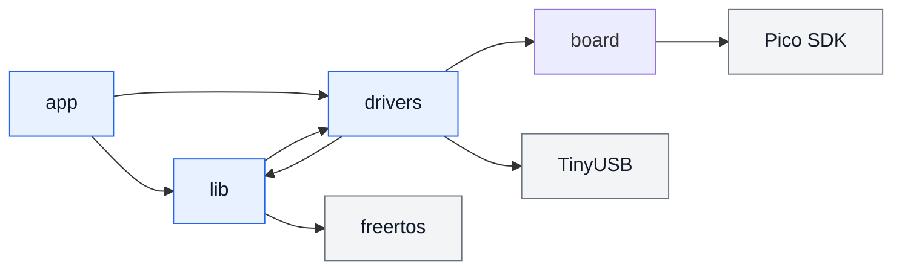

# アーキテクチャ

## 目的

ハードウェア依存処理と製品固有処理を分離し、MIDI変換や入力処理をPC上で単体テストできる構成にします。

## ディレクトリ構成

```text
usb_midi_pedal/
├─ boards/                  必要になった場合の独自Pico SDKボード定義
├─ cmake/                   Pico SDKとFreeRTOS Kernelのインポート
├─ config/                  FreeRTOS、TinyUSB、アプリ設定
├─ docs/                    設計資料と設計判断
│  └─ decisions/
├─ external/                Git submoduleなどの外部依存
├─ src/
│  ├─ app/                  製品固有処理、タスク、状態管理
│  │  ├─ app_controller/    状態機械、設定、保存、UIモデル
│  │  ├─ runtime/           実行設定とペダルイベントの処理
│  │  └─ tasks/
│  ├─ board/                基板固有の初期化とピン設定
│  ├─ drivers/              Pico SDKおよびデバイス依存処理
│  │  ├─ din_midi/
│  │  ├─ display/
│  │  ├─ expression/
│  │  ├─ flash_storage/
│  │  ├─ footswitch/
│  │  ├─ log_output/
│  │  ├─ rgb_led/
│  │  └─ usb_midi/
│  └─ lib/                  ハードウェア非依存の再利用可能な処理
│     ├─ concurrency/
│     ├─ graphics/
│     ├─ input/
│     ├─ midi/
│     └─ preset/
├─ tests/                   PC上で実行する単体テスト
│  ├─ lib/
│  ├─ drivers/
│  └─ mocks/
└─ tools/                   開発用補助ツール
```

## 各層の責務

### `app`

- 製品固有のタスクの生成と実行
- Queueやタスク通知による処理の連携
- 動作モード、画面遷移、プリセット選択などの製品固有処理
- `lib`および`drivers`の組み合わせ
- `app_controller`と`runtime`間のコマンド・返信による制御系と実行系の分離

### `lib`

- MIDIイベント、マッピング、ルーティング
- フットスイッチのデバウンスと長押し判定
- EXPペダル値のフィルタリングと変換
- プリセットのデータ構造とエンコード
- OLEDへ描画するフレームバッファ処理

`lib`はPico SDKに依存させません。FreeRTOSを固定採用するため、`lib/rtos_wrapper`は
FreeRTOSに直接依存します。`lib`から`drivers`への依存を許可し、`lib/logging`は
ログ出力ドライバを利用します。

### `drivers`

- GPIOによるフットスイッチ入力
- ADCによるEXPペダル入力
- I2C OLED制御
- RGB LED制御
- UARTによるDIN MIDI OUT
- TinyUSBによるUSB MIDI
- 内蔵flashへの読み書き

### `board`

- GPIO、ADC、I2C、UARTのピン割り当て
- Pimoroni Tiny 2040固有の初期化
- ドライバへ渡すハードウェア設定

### `external`

Pico SDKやFreeRTOS Kernelなど、プロジェクト外で開発される依存コードをGit submoduleとして管理します。プロジェクト内部の`lib`とは明確に区別します。

## 依存関係



依存方向について、次の規則を設けます。

- `app`は`lib`と`drivers`を利用できます。
- `drivers`は共通データ型を利用するために`lib`へ依存できます。
- `lib`は`app`へ依存してはいけません。`lib`から`drivers`への依存は許可します。
- `lib/rtos_wrapper`はFreeRTOSに直接依存し、静的に確保した同期オブジェクト、メールボックスおよび状態機械を提供します。
- Pico SDK APIは`drivers`と`board`内に閉じ込めます。
- `app_controller`は設定の正本を、`runtime`は有効化済み設定のコピーと演奏中の状態を所有します。

## コードの配置例

| 処理 | 配置先 |
| --- | --- |
| GPIOの読み取り | `drivers/footswitch/` |
| スイッチのデバウンス計算 | `lib/input/` |
| 入力を周期的に走査するFreeRTOSタスク | `app/tasks/` |
| FreeRTOS Queueを用いるメールボックス | `lib/rtos_wrapper/` |
| FreeRTOS Event Group、Semaphore、Mutexを用いる同期機能 | `lib/rtos_wrapper/` |
| メールボックスとEvent Flagを用いる状態機械 | `lib/rtos_wrapper/` |
| タスク間排他を伴う診断ログの整形 | `lib/logging/` |
| USB CDCまたはUARTへのログ実出力 | `drivers/log_output/` |
| MIDIメッセージの生成 | `lib/midi/` |
| USB MIDIパケットの送信 | `drivers/usb_midi/` |
| DIN MIDIバイトの送信 | `drivers/din_midi/` |
| プリセット変更時の処理連携 | `app/` |
| プリセットのシリアライズ | `lib/preset/` |
| flashの消去と書き込み | `drivers/flash_storage/` |

状態機械、タスク、Queue、モジュール間通信および保存方針は[Runtimeアーキテクチャ](runtime-architecture.md)を参照する。
