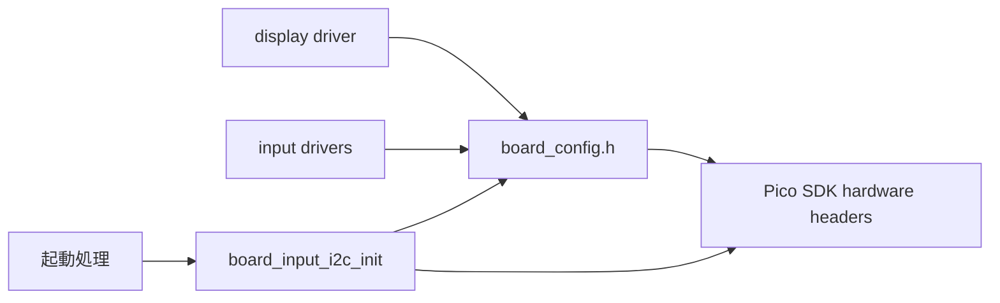

# ボード設定設計

## 概要

- 種別: 実装設計
- 対応Issue: #28
- 対象: Pimoroni Tiny 2040のピンおよびペリフェラル設定と初期化

`src/board/board_config.h`は、製品基板に固有のGPIO、I2CおよびUARTの設定値を一元管理する。`src/board/input_i2c.c`は共有入力系I2C1を初期化する。

## スコープ

### 対象

- OLED専用I2C0および入力系I2C1のピン、通信速度、接続デバイスのI2Cアドレス
- ADS1015のData Ready入力ピン
- DIN MIDIおよびデバッグUARTのインスタンスと送信ピン
- ロータリーエンコーダーの入力ピン
- 内蔵RGB LEDの各チャネルのGPIOとactive-low設定

### 対象外

- OLED用I2C0、UART、個別デバイスGPIOの初期化
- I2CおよびUARTの通信処理
- 未使用GPIOの割り当て

## 責務と依存関係

- `board_config.h`は基板固有の定数だけを提供する。
- 共有I2C1の初期化は`board_input_i2c_init()`が担い、繰り返し呼び出しても再初期化しない。起動処理は初期化失敗時に停止する。
- 個別デバイスGPIO初期化と通信制御は`drivers`が担う。
- Pico SDKへの依存は`board`内に閉じ込める。

## 公開インターフェース

`board_config.h`は次の接頭辞を持つマクロを公開する。

- `BOARD_OLED_I2C_*`: OLED専用I2C0のインスタンス、ピン、アドレス
- `BOARD_INPUT_I2C_*`: ADS1015およびMCP23017共有のI2C1のインスタンス、ピン
- `BOARD_I2C_BAUD_RATE_HZ`: 両I2Cバスの通信速度
- `BOARD_EXPRESSION_ADC_READY_PIN`: ADS1015のData Ready入力ピン
- `BOARD_DIN_MIDI_UART_*`: DIN MIDI出力用UART
- `BOARD_DEBUG_UART_*`: デバッグUART
- `BOARD_ENCODER_*`: ロータリーエンコーダーの入力ピン
- `BOARD_RGB_LED_*`: 内蔵RGB LEDのR/G/B各チャネルのGPIOと極性

`input_i2c.h`は`bool board_input_i2c_init(void)`を公開する。I2C1を設定し、SDA/SCLをI2C機能へ割り当ててプルアップを有効にする。

I2CおよびUARTのインスタンスはPico SDKの`i2c0`、`i2c1`、`uart0`、`uart1`を用いる。OLEDは`i2c0`、入力系デバイスは`i2c1`を用いる。

## 検証方針

- `board_config.h`を含むファームウェアをDebug構成でビルドする。
- 値が[ピン割り当て](../specifications/pin_assignment.md)と一致することをレビューする。
