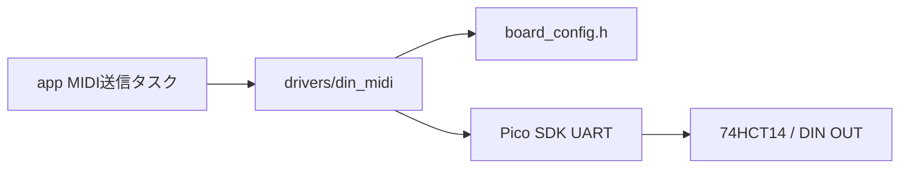
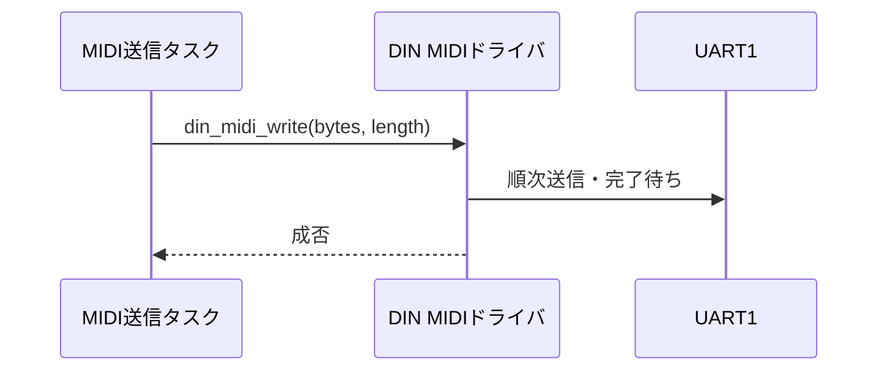

# DIN MIDI OUT UARTドライバ設計

## 概要

- 状態: 実装済み（実機検証待ち）
- 対応Issue: #21
- 目的: MIDIバイト列をUART1 TXからDIN MIDI OUTへ送る。

## スコープ

- 対象: UART1初期化とバイト列送信。
- 対象外: Program Change / Control Changeの組立て、MIDI IN、スルー機能。

## 責務と依存関係



## 公開インターフェース

```c
bool din_midi_init(void);
bool din_midi_write(const uint8_t *bytes, size_t length);
```

- `write`は渡されたMIDIバイト列を順番にUART送信し、送信完了後に返る。バッファは呼び出し側が保持する。
- NULL、不正長、初期化前呼出しは`false`。並列呼出しは呼び出し側で直列化する。
- 初期化はUARTの実baud rateが0の場合に失敗する。送信はSDKのブロッキングAPIを使い、全バイトの送出完了を待つ。
- MIDIメッセージの妥当性確認と組立ては`lib/midi`または`app`が担当する。

## 処理フロー



## RTOS・ハードウェア上の考慮

- `BOARD_DIN_MIDI_UART_INSTANCE`のUART1 TXをGP4へ設定し、31,250 bit/s、8データbit、パリティなし、1ストップbitで送信する。
- 74HCT14の2段反転によりDIN端子へ非反転波形を送る。Pico SDK APIはドライバ内に限定する。
- ブロッキング送信の最大時間は1バイト約320 µs。長い送信列のタスク占有には呼び出し側で配慮する。

## 検証方法

- Program Change（2バイト）とControl Change（3バイト）の波形と受信内容を実機で確認する。
- 初期化時の実際のbaud rateとUART0デバッグ出力への非干渉を確認する。

## 未決定事項

- 長いSysEx送信を扱う場合のキューと非同期化は別設計とする。
