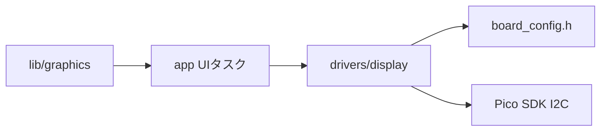
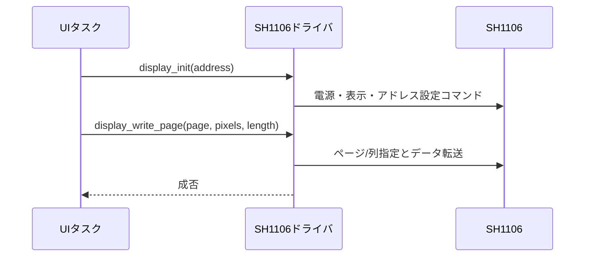

# SH1106 OLED表示ドライバ設計

## 概要

- 状態: 実装済み（実機確認待ち）
- 対応Issue: #19
- 目的: 128×64 SH1106 OLEDへI2Cで画面データを送る。

## スコープ

- 対象: OLED初期化、コマンド送信、ページ単位の描画転送。
- 対象外: フォント、UI状態、フレームバッファ描画ロジック。

## 責務と依存関係



- OLEDはGP0/GP1の専用I2C0、3.3 V、400 kHz。デフォルトアドレスは`0x3C`、`0x3D`を設定可能にする。入力系I2C1との共有はしない。

## 公開インターフェース

```c
bool display_init(uint8_t address);
bool display_write_command(uint8_t command);
bool display_write_page(uint8_t page, const uint8_t *pixels, size_t length);
```

- `address`は`0x3C`または`0x3D`のみ。`page`は0〜7、`length`は最大128で、各バイトが縦8画素を表す。
- 転送元の所有権は呼び出し側にあり、同期転送終了まで有効にする。NACK、不正引数、初期化前呼出しは`false`。
- `length`は128列ちょうどを要求する。SH1106の132列RAMに対する128列の可視領域オフセットは2列としてドライバで吸収する。
- バスはboard設定に従いI2C0、GP0/GP1、400 kHzで初期化する。初期化時のI2C転送はタイムアウト付き同期転送とする。
- フォント、UI状態、描画用フレームバッファは本ドライバに含めず、別の`lib/graphics`で扱う。

## 処理フロー



## 検証方法

- 全8ページへ128列のパターンを描画し、端列と上下端を確認する。
- ADS1015とMCP23017をI2C1で同時稼働させ、両バスの正常動作を確認する。

## 未決定事項

- OLEDモジュールごとの列オフセットと初期化コマンドは実機で確認する。現在の実装は列オフセット2、標準的なSH1106電源・走査設定を仮定する。
- Issue #19はI2Cバス共有を完了条件に挙げるが、確定した配線仕様はOLED専用I2C0と入力系I2C1に分離する。
