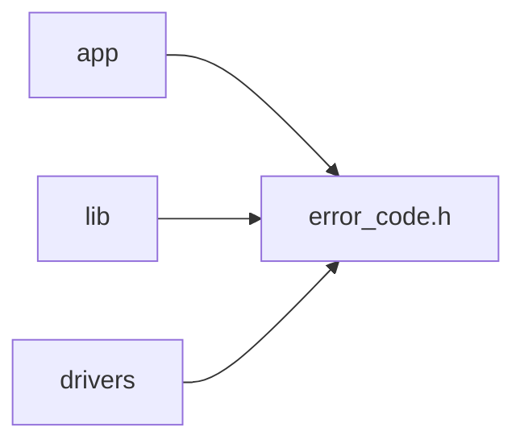

# 共通エラーコード設計

## 背景

- 種別: 共通データ型
- 対象Issue: #27
- 目的: 各コンポーネントが失敗理由を一貫した型で呼び出し元へ返せるようにする。
- 範囲: ハードウェアやFreeRTOSに依存しない同期的な処理結果。

## スコープ

### 対象範囲

- 成功、引数不正、範囲外、未初期化、I/O、タイムアウト、保存、未対応の結果を表す。
- 公開ヘッダを `src/inc/error_code.h` に配置する。

### 対象外

- エラー文字列の管理
- ログ出力
- FreeRTOS固有のエラー値やPico SDKのエラー値の公開

## インターフェース

```c
typedef enum {
    ERROR_CODE_OK = 0,
    ERROR_CODE_INVALID_ARGUMENT,
    ERROR_CODE_OUT_OF_RANGE,
    ERROR_CODE_NOT_READY,
    ERROR_CODE_IO,
    ERROR_CODE_TIMEOUT,
    ERROR_CODE_STORAGE,
    ERROR_CODE_UNSUPPORTED,
} error_code_t;
```

- `ERROR_CODE_OK` は必ず 0 とする。
- それ以外の値は成功以外の結果を表す。呼び出し元は個別の失敗理由を判定できる。
- 列挙値はハードウェア、Pico SDK、FreeRTOSに依存させない。

## 依存関係



- `error_code.h` は宣言のみを持ち、他のプロジェクトヘッダやSDKヘッダへ依存しない。

## 検証方針

- Debugビルドで `src/inc` がターゲットのインクルードパスとして設定されることを確認する。
- ヘッダを利用する各コンポーネントの単体テストでは、成功と代表的な失敗コードを検証する。
