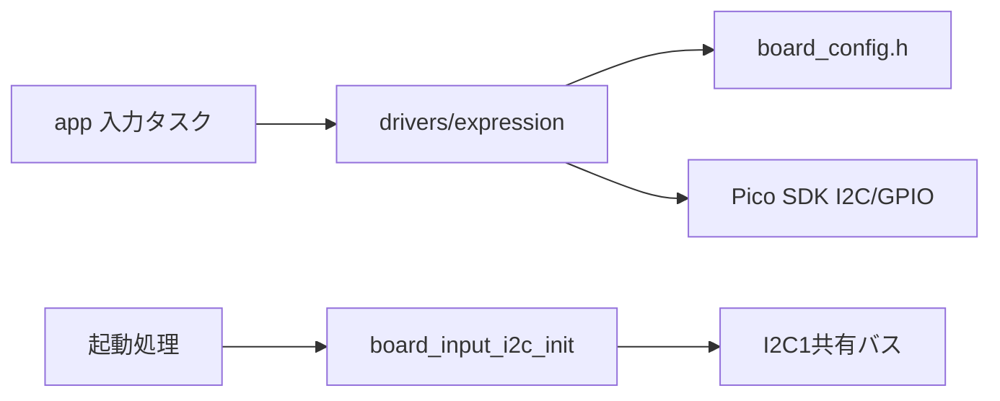
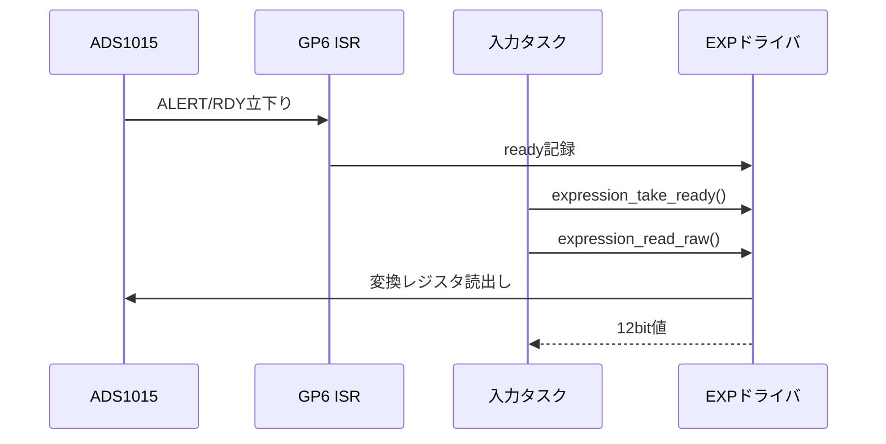

# ADS1015 EXP入力ドライバ設計

## 概要

- 状態: 実装済み（実機確認待ち）
- 対応Issue: #18
- 目的: ADS1015のAIN0を1.6 kSPSの連続変換で取得する。

## スコープ

- 対象: ADS1015設定、Data Ready通知、変換値の読み取り。
- 対象外: EXP値の平滑化、MIDI値への変換、入力タスク。

## 責務と依存関係



- ADS1015はI2C1の`0x48`。MCP23017とバスを共有し、呼び出し側がアクセスを直列化する。共有バスは起動時に`board_input_i2c_init()`で一度初期化し、EXPドライバはADS1015設定とGPIO割り込みを担当する。Pico SDK APIとGPIO割り込み処理はドライバ内に閉じ込める。

## 公開インターフェース

```c
bool expression_init(void);
bool expression_take_ready(void);
bool expression_read_raw(uint16_t *sample);
```

- `take_ready`はISRで記録したData Readyを消費する非ブロッキング操作。ISRでI2C通信を行わない。
- `read_raw`は変換レジスタの符号付き12 bit値を解釈し、負値を0へクランプする。公開値の範囲は0〜2047。失敗時は出力を変更しない。
- レジスタ書込、ポインタ選択、変換値読出しは有限のSDK I2Cタイムアウトを指定し、通信失敗またはタイムアウト時に`false`を返す。
- 初期化失敗、I2C失敗、NULL出力を`false`で返す。複数タスクからの同時利用は想定しない。
- GPIO ISRはreadyフラグだけを設定し、`take_ready`は割り込みを短時間無効化してフラグを消費する。割り込みを取りこぼさず安全にタスクへ渡す。

## 処理フロー



## RTOS・ハードウェア上の考慮

- AIN0単一エンド、連続変換、1.6 kSPS、PGAは3.3 V入力を覆う±4.096 Vに設定する。
- Data Readyのため上限`0x8000`、下限`0x0000`、active-low、コンパレータキュー有効値を設定する。
- 閾値レジスタを設定後、設定レジスタを書いて連続変換を開始し、GPIO立下り割り込みを有効にする。
- GPIOは`BOARD_EXPRESSION_ADC_READY_PIN`（GP6）。ISRはフラグ更新のみ行う。1変換は約0.625 msで、I2C読出しと入力処理が1 ms以内に完了することを実機で測る。

## 検証方法

- 実機で最小・最大・連続変化、割り込み周期、I2Cエラーを確認する。

## 未決定事項

- Issue #18本文はGP0と記載するが、確定したピン仕様と`board_config.h`ではGP6。GP0はOLEDのSDAであり、実装はGP6を採用する。
