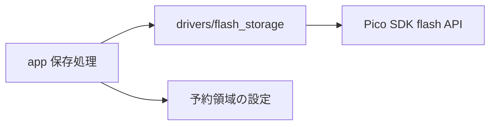
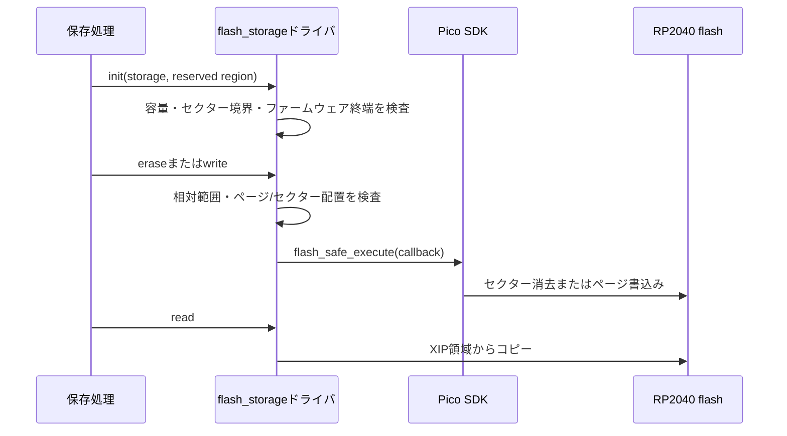

# 内蔵flashストレージドライバ設計

## 概要

- 状態: 実装済み
- 対応Issue: #24
- 目的: 呼び出し側が予約した内蔵flash領域に対する低レベルの読出し、消去、書込みを提供する。

## スコープ

- 対象: 予約領域の読出し、セクター消去、ページ書込み、容量・境界・配置検査。
- 対象外: 保存形式、CRC等の破損検出、初期値、プリセット管理、容量やリンカ領域の決定。

## 責務と依存関係



- ドライバーはRP2040 flash APIを呼び出し、初期化時に受け取った領域の範囲内に操作を制限する。
- アプリ側は製品の容量方針に基づいて予約領域を定義し、他の永続データや更新イメージと重ならないようにする。
- 保存レコードや整合性の責務は上位層に置く。

## 公開インターフェース

```c
typedef struct {
    uint32_t flash_offset;
    size_t capacity;
} flash_storage_region_t;

typedef struct {
    uint32_t flash_offset;
    size_t capacity;
    bool initialized;
} flash_storage_t;

bool flash_storage_init(flash_storage_t *storage, const flash_storage_region_t *region);
bool flash_storage_read(const flash_storage_t *storage, size_t offset, void *dst, size_t length);
bool flash_storage_erase(const flash_storage_t *storage, size_t offset, size_t length);
bool flash_storage_write(const flash_storage_t *storage, size_t offset,
                         const uint8_t *src, size_t length);
size_t flash_storage_capacity(const flash_storage_t *storage);
```

- `flash_offset`はチップ内flash先頭からのバイト位置、操作の`offset`は初期化した領域先頭からの相対値。
- 初期化時に領域の開始・容量のセクター整列、SDKが選択ボードに定義するflash容量内であること、リンク済みファームウェアイメージ終端以降であることを検査する。
- 読出しは任意の非ゼロ長、消去は4 KiBセクター境界、書込みは256 byteページ境界のみを受け付ける。各操作は範囲と減算形式の境界検査でオーバーフローを避ける。
- 書込み元はRAM上に置く。XIPアドレス空間を指すソースは拒否する。
- `false`は未初期化、引数、範囲、配置違反、またはSDKの安全実行失敗を示す。SDKのタイムアウトはコールバック実行後にも返る場合があり、その場合に書込み結果が不明となることがある。
- 書込み前に対象領域が消去済みであることは呼び出し側が保証する。

## 処理フロー



## RTOS・ハードウェア上の考慮

- 消去・書込みは`flash_safe_execute()`の安全実行コールバック内で行う。Pico SDKは割り込みを停止し、構成に応じて他コアをflashアクセス不能にしてからflash APIを呼び出す。
- 現在のファームウェアはFreeRTOS単一コア構成であり、コア1を起動しないことを前提とする。マルチコア化する場合はSDKのflash-safe初期化・コア連携も見直す。
- ISRから読出し、消去、書込みを呼び出さない。書込みソースとflash安全実行に必要な要求情報はRAM上に置く。
- 初期化は複数タスクから利用する前に行う。ドライバーは物理的なファームウェアイメージ終端より後の領域であることを検査するが、その領域が製品設定・ブートローダー・更新イメージ等に予約されているかまでは判断できない。

## 検証方法

- 実機で予約領域の消去・書込み・読出し一致、境界外と非整列要求の拒否、再起動後の保持を確認する。
- 実機確認では、選択領域がリンク済みイメージ、ファームウェア更新領域、その他の永続データと重ならないことを先に確認する。

## 決定事項と制限

- Tiny 2040のflash容量はREADME記載の8 MiBだが、SDK選択ボードの`PICO_FLASH_SIZE_BYTES`を容量の正本として使う。
- このIssueでは予約容量・開始位置・リンカ予約・最大ファームウェアサイズを決めない。アプリ側は製品容量方針を決めて`flash_storage_region_t`を渡す必要がある。
- リンカ終端検査は実行時のファームウェアイメージと重なる領域を拒否する。固定のflash末尾を自動予約せず、更新手段や他データ領域との重複排除は呼び出し側の責任とする。
- 電源断時の原子性、破損検出、復旧方式は保存形式側の設計で定める。
