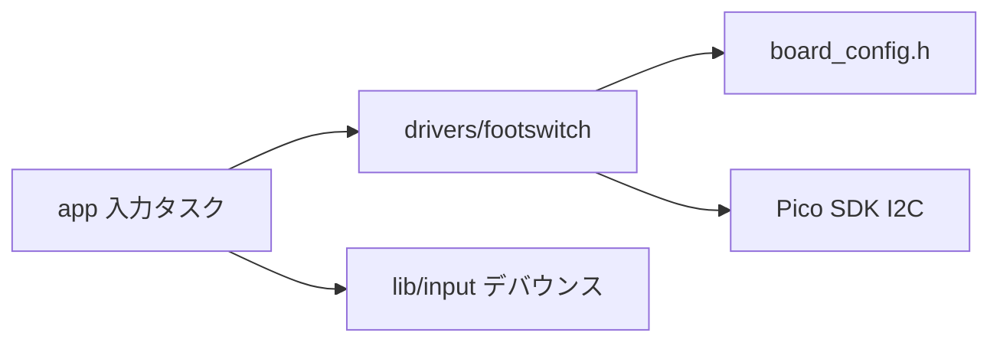
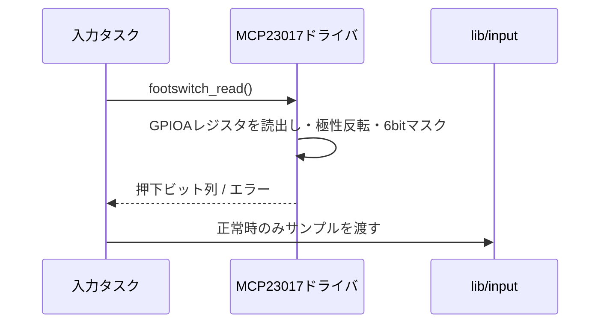

# MCP23017フットスイッチ入力ドライバ設計

## 概要

- 状態: 実装済み
- 対応Issue: #17
- 目的: MCP23017のGPA0〜GPA5を6個のactive-low入力として取得する。

## スコープ

- 対象: 初期化済みI2C1を使ったMCP23017初期化と6入力のスナップショット取得。
- 対象外: デバウンス、押下・解放イベント判定、入力タスク。

## 責務と依存関係



- アドレスは`0x20`。GPA0〜GPA5のみ入力として使用し、外部プルアップを使う。未使用端子の設定は将来の拡張を妨げない値にする。
- 起動時に`board_input_i2c_init()`が共有I2C1とGPIO2/3を一度初期化する。`footswitch_init()`はMCP23017のPort Aを入力・非反転・内部プルアップ無効に設定する。Port Aの未使用端子も入力にして出力駆動を避ける。
- I2C1はADS1015と共有するため、呼び出し側でバス操作を直列化する。ドライバはFreeRTOSへ依存しない。
- MCP23017との全てのI2C読み書きに`i2c_write_timeout_us()`または`i2c_read_timeout_us()`を使う。タイムアウトまたは転送長不一致は`false`として返す。

## 公開インターフェース

```c
bool footswitch_init(void);
bool footswitch_read(uint8_t *pressed_mask);
```

- `pressed_mask`のbit 0〜5はフットスイッチ1〜6の押下状態。押下を1に正規化し、上位2 bitは0とする。
- `false`はNACKなどの通信失敗または不正引数を表す。失敗時は出力引数を変更しない。呼び出し元が前回値を保持し、誤イベントを生成しない。
- 初期化後、タスク文脈から周期的に呼び出す。ISRからは呼び出さない。
- `footswitch_init()`より前に共有I2C1を初期化しておく。
- 初期化と読み出しは`src/drivers/footswitch/footswitch.c`に実装する。ヘッダーは`footswitch.h`。

## 処理フロー



## 検証方法

- 6入力の単独・同時押下と解放、I2C障害時のエラーを確認する。
- 実機で各スイッチのデバウンス後イベントを確認する。

## ハードウェア前提

- MCP23017は3.3 Vロジックで動作し、I2C1のSDA/SCL（GPIO2/3）に接続する。
- GPA0〜GPA5はスイッチ開放時にHighとなる外部プルアップを備え、押下時にGNDへ接続する。
- I2C1はEXP ADCと共有する。バス利用の直列化は呼び出し側が担い、ドライバ内ではロックしない。

## 未決定事項

- 入力タスクの走査周期とデバウンス時間は別Issueで定める。
