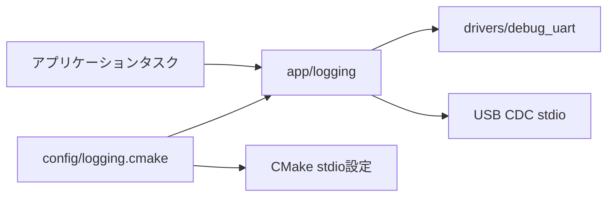
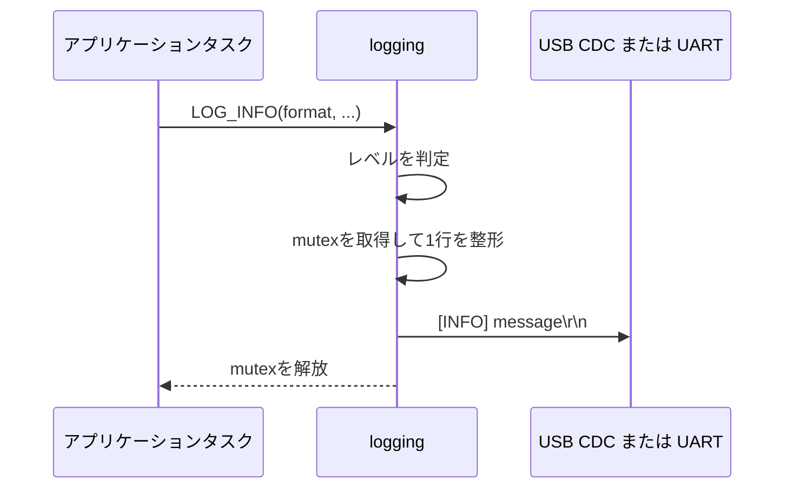

# ログ出力 設計

## 背景・目的

- 種別: 新規モジュール
- 対象Issue: #22
- 目的: ファームウェアの診断ログを USB CDC またはデバッグ UART TX へ出力する。
- 背景: GP28 の UART0 TX は診断用に割り当てられており、USB 接続中には USB CDC を使う選択肢も必要である。

## スコープ

### 対象

- `error`、`warn`、`info`、`debug` の4ログレベル
- `config/logging.cmake` による出力先と最低出力レベルのビルド時選択
- UART0/GP28 を用いるデバッグ UART の初期化と送信
- 複数の FreeRTOS タスクからのログ行単位の排他

### 対象外

- ログの flash 保存、USB CDC と UART への同時出力、ISR からのログ出力

## 要求

- 出力先は `LOG_OUTPUT=USB_CDC` または `LOG_OUTPUT=UART` で選択できること。
- `LOG_LEVEL` で選択したレベルより詳細なログを出力しないこと。
- 各ログ行を `[LEVEL] message\r\n` の形式で出力すること。

## 責務と依存関係



- `app/logging` はレベルフィルタ、書式化、タスク間排他、出力先の振り分けを担う。
- `drivers/debug_uart` は Pico SDK の UART0/GP28 操作だけを担う。
- `config/logging.cmake` は出力先と最低出力レベルを定義し、CMake がコンパイル定義と stdio 設定へ変換する。

出力先と最低出力レベルは、設定ファイルの既定値を変更するか、CMake 構成時に上書きする。

```powershell
cmake -DLOG_OUTPUT=USB_CDC -DLOG_LEVEL=INFO --preset debug
cmake --build --preset debug
```

## 公開インターフェース

```c
typedef enum {
    LOG_LEVEL_ERROR = 0,
    LOG_LEVEL_WARN,
    LOG_LEVEL_INFO,
    LOG_LEVEL_DEBUG,
} log_level_t;

void logging_init(void);
void logging_write(log_level_t level, const char *format, ...);
```

- `LOG_ERROR`、`LOG_WARN`、`LOG_INFO`、`LOG_DEBUG` は `logging_write` を呼ぶマクロである。
- `logging_init` はスケジューラ開始前に一度だけ呼ぶ。
- API はタスクコンテキスト専用であり、ISR から呼んではならない。

## データ設計

- ログ行は固定長256バイトのスタックバッファで作成する。長いメッセージは切り詰める。
- ログ専用の静的 FreeRTOS mutex により、複数タスクの出力をログ行単位で直列化する。

## 処理フロー



## RTOS・ハードウェア上の注意

- UART を選んだ場合は UART0 TX の GP28 を 115200 bit/s、8N1 で使用する。
- UART の送信は完了まで待機するため、ログ多発経路では使用しない。
- USB CDC は TinyUSB の stdio バックエンドを使用する。

## テスト方針

- Debug ビルドで `LOG_OUTPUT=UART` と `LOG_OUTPUT=USB_CDC` の両方をビルドする。
- UART 選択時は USB-UART 変換器で、USB CDC 選択時はホストの仮想 COM ポートで各レベルの行を確認する。

## 未確定事項

- なし
