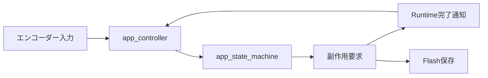
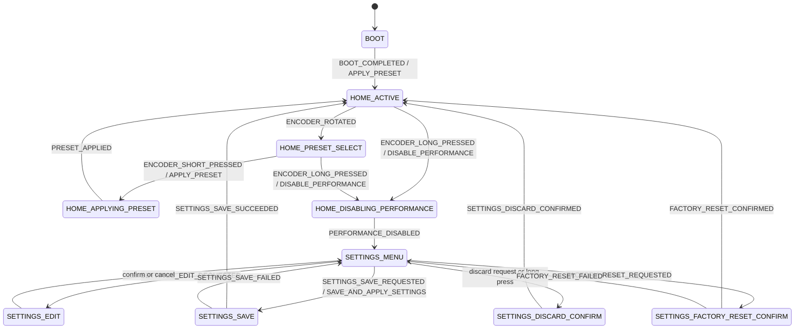

# 操作状態ステートマシン設計

## 概要

- 状態: 実装済み
- 対応Issue: #42
- 目的: 通常操作、プリセット選択、設定操作の画面遷移と、Runtimeへ依頼する副作用を一元管理する。
- 背景: Runtimeアーキテクチャで定義した状態遷移を、FreeRTOSおよびハードウェアに依存しないC11モジュールとして実装する。

## スコープ

### 対象

- `BOOT`、通常画面、プリセット選択、設定画面の状態遷移
- 設定画面へ入る前の演奏停止完了待ち
- プリセット反映、演奏停止、保存、設定破棄、工場出荷状態リセットの副作用通知

### 対象外

- UI描画、エンコーダーのデバウンスおよび長押し判定
- Runtimeコマンド、Flash保存、設定データの具体的な実行
- FreeRTOSタスクとQueueの生成

## 責務と依存関係



- `app_state_machine`は、現在状態とイベントから次状態および副作用を決定する。
- `app_controller`は、返された副作用をRuntimeまたは保存処理へ送信し、完了時に対応するイベントを再投入する。
- 本モジュールはC標準ライブラリ以外に依存せず、`src/app/app_controller/`に配置する。

## 公開インターフェース

```c
app_state_t app_state_machine_initial_state(void);
bool app_state_machine_transition(
    app_state_t current_state,
    app_state_event_t event,
    app_state_transition_t *transition);
```

- 入力: 現在の`app_state_t`と、エンコーダー操作またはRuntime・保存処理の完了を表す`app_state_event_t`。
- 出力: 処理済みの場合、`app_state_transition_t`に次状態と`app_state_action_t`を返す。
- エラー処理: 不正な状態、イベント、またはNULLの出力先は`false`を返す。現在状態で処理できないイベントも`false`を返し、出力先を変更しない。
- 所有権・ライフサイクル: 状態の保持と副作用の実行は呼び出し側の`app_controller`が担当する。状態機械は静的データおよび動的メモリを使用しない。

## データ設計

- `app_state_t`: `BOOT`、通常画面、設定画面と、非同期完了待ちを表す10状態。
- `app_state_event_t`: 入力操作および副作用の成功・失敗を表す17イベント。
- `app_state_action_t`: 呼び出し側が実行すべき副作用を表す6種別。
- 永続化するデータ: なし。

## 処理フロー



`HOME_DISABLING_PERFORMANCE`はUIに設定画面を表示しない内部状態である。`PERFORMANCE_DISABLED`を受け取るまで`SETTINGS_MENU`へ遷移しないため、設定中にRuntimeがMIDIを生成しないというRuntimeアーキテクチャの条件を満たす。

## RTOS・ハードウェア上の考慮

- 実行コンテキスト: `app_controller_task`のみから呼び出す。
- Queue・通知: エンコーダーイベントとRuntime・保存処理の完了通知を、呼び出し側で逐次処理する。
- メモリとスタック: 動的メモリ、FreeRTOS API、Pico SDK APIを使用しない。

## 検証方法

- Unityの`app_state_machine_test`で、全ての主要遷移、副作用、失敗時の復帰、不正入力を検証する。
- `cmake --preset host-tests`、`cmake --build --preset host-tests`、`ctest --test-dir build/host-tests --output-on-failure`を実行する。
- `cmake --preset debug`と`cmake --build --preset debug`でファームウェアへの組込みを確認する。

## 未決定事項

- `app_controller`が副作用の失敗をどのUIモデルとLED表示へ反映するか。
