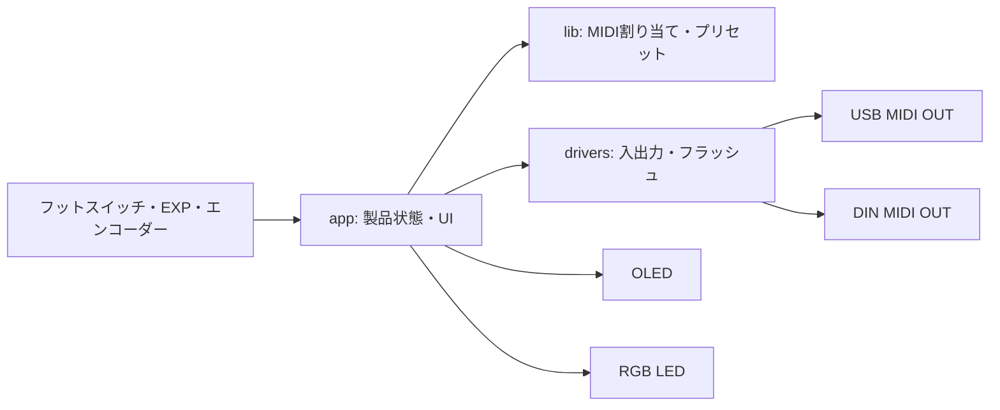
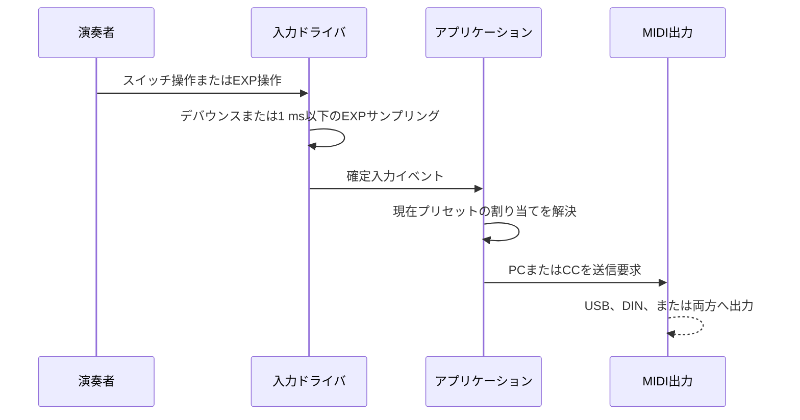

# 製品要件・仕様 設計

## 概要

- 状態: 確定（製品要件）
- 対応Issue: #6
- 目的: DAW上でギターを演奏しながら、足元の操作で音色やエフェクトの状態を標準MIDIで制御する。
- 背景: 演奏を中断してPCを操作せず、フットスイッチとEXPペダルでDAW内のギター音色を切り替え・制御したい。本プロジェクトは[Pi_Pedal](https://github.com/starkensan/Pi_Pedal)の後継として開発する。

本製品は特定のDAW固有機能に依存しない。USB MIDIおよびDIN MIDI OUTへ標準MIDIメッセージを出力するMIDIフットペダルである。

## スコープ

### 対象

- フットスイッチ6個、EXPペダル1個、押しボタン付きロータリーエンコーダー、128×64 I2C OLED、RGB LEDを備える。
- Program Change（PC）およびControl Change（CC）を送信する。
- 最大10個のプリセットをフラッシュへ保存し、ロータリーエンコーダーで呼び出す。
- USB MIDI OUT、DIN MIDI OUT、または両方へMIDIを送信する。
- OLEDからプリセットと本体共通設定を編集、保存、初期化する。

### 対象外

- 特定DAW向けの独自プロトコル、プラグイン連携、DAW操作の自動化
- USB MIDI IN、DIN MIDI IN、MIDI THRU、USB MIDIからDIN MIDIへのスルー
- 1回のフットスイッチ操作から複数のMIDIメッセージを送るマクロ機能

## 要件

### MIDI送信

- 送信するMIDIチャンネルは、全フットスイッチとEXPペダルで共通とする。本体設定で変更できる。
- 出力先はUSB MIDI OUT、DIN MIDI OUT、両方から選び、本体共通設定として保存する。
- フットスイッチごとに、次のいずれか1種類の動作をプリセットごとに設定できる。
  - 指定番号のPCを送信し、その番号を現在PC番号にする。
  - PC Next: 現在PC番号を1増やしてPCを送信する。
  - PC Back: 現在PC番号を1減らしてPCを送信する。
  - CCトグル: ON値とOFF値を交互に送信する。
  - CCモーメンタリー: 踏下値を押下時、解放値を解放時に送信する。
- PC番号は0〜127とし、PC Next／PC Backでは範囲端で循環する。
- CCトグルとCCモーメンタリーの値は、各スイッチごとに設定できる。
- EXPペダルは設定したCC番号と最小値・最大値の範囲で連続値を送信する。

### プリセットと永続化

- 最大10個のプリセットを保存する。プリセットには6スイッチの割り当て、EXP設定、現在PC番号の初期値を含める。
- 通常モードでは、エンコーダー回転でプリセット候補を選択し、エンコーダー押下で確定する。
- プリセット確定だけではMIDIを送信しない。以後のフットスイッチまたはEXP操作に、確定したプリセットを使用する。
- PC Next／PC Backで変化した現在PC番号は自動保存しない。プリセット確定時および電源再投入時には、保存済みの初期値を使用する。
- 設定の変更は「保存して終了」を選んだ場合にだけフラッシュへ保存する。「保存せず終了」では変更を破棄する。
- 初回起動または保存データの破損時には、安全な初期値で起動する。
- 設定モードから、確認操作を伴う工場出荷状態リセットを実行できる。リセットは全プリセットと本体共通設定を初期値へ戻す。

### UIと表示

- エンコーダー押しボタンの長押しで設定モードへ入る。
- 設定モードでは、エンコーダー回転で項目または値を選び、短押しで決定する。
- 通常画面は、現在PC番号、各CCトグルのON／OFF、各CCモーメンタリーの押下状態、EXP値（0〜127）とバーを表示する。
- PC用スイッチは個別のON／OFFを持たず、現在PC番号で状態を表す。

### 入力、性能、表示灯

- フットスイッチにはチャタリング除去を必ず適用する。操作遅延よりも誤検出防止を優先する。
- EXPペダルは1 ms以下の周期でサンプリングする。入力値がデッドバンドを超えて変化したとき、速やかにMIDI送信処理へ渡す。
- USBまたはDINの送信完了時刻、およびUSB接続先PCでの受信時刻は、通信およびOSの都合により1 ms以下を保証しない。
- RGB LEDは主に開発・診断用のハートビートとして使用する。起動、設定モード、保存成功・失敗、MIDI送信も補助的に通知する。

## 責務と依存関係

- `app`は、通常モード・設定モード・プリセット選択・保存操作を管理する。
- `lib`は、MIDIメッセージ、PC番号の循環、CC状態、プリセットデータをハードウェア非依存で扱う。
- `drivers`および`board`は、入力取得、OLED、LED、フラッシュ、USB MIDI OUT、DIN MIDI OUTを扱う。

## 公開インターフェース

- 外部機器に対する公開インターフェースはUSB MIDI OUTと5ピンDIN MIDI OUTである。
- 送信メッセージは標準MIDIのProgram ChangeおよびControl Changeに限定する。
- DIN端子はMIDI OUT専用とする。

## データ設計

- 本体共通設定: MIDIチャンネル、MIDI出力先。
- プリセット設定: 現在PC番号の初期値、各スイッチの動作種別とMIDIパラメータ、EXPのCC番号と最小値・最大値、EXPキャリブレーション値。
- 保存上限: 10プリセット。
- EXPキャリブレーションは、実機で踏み込んだ最小・最大のADC値を記録し、MIDI値0〜127へ変換する。

## 処理フロー

## RTOS・ハードウェア上の考慮

- EXPのサンプリングは1 ms以下の周期で実行する。
- フットスイッチは安定確認型のデバウンスを用いる。具体的な時間は実機で決定する。
- DIN MIDI OUTは5ピンDINの出力専用とする。
- ロータリーエンコーダーは回転入力と押しボタン入力を持つ。
- 電源はTiny 2040基板上のUSB-C端子からの5 V給電のみとし、外部9 Vペダル電源および電池には対応しない。
- EXP入力は6.35 mm TRSジャックを使用し、外部I2C ADCのMCP3221で読み取る。
- OLEDは1.3インチ、128×64、SH1106、I2C、3.3 Vとする。
- フットスイッチは6個のNOモーメンタリースイッチとし、スイッチ内蔵LEDは使用しない。
- 電気仕様およびGPIO割り当ての詳細は[ハードウェア仕様](../hardware.md)と[ピン割り当て](../pin_assignment.md)を参照する。

## 検証方法

- PC上の単体テストで、PC番号の循環、CCトグル／モーメンタリー、プリセット切替、保存・破棄を検証する。
- 実機で、全入力のチャタリング除去、EXPキャリブレーション、OLED表示、USB／DINの各出力先を検証する。
- MIDIモニターおよびDIN MIDI受信機器で、設定したPC／CC、チャンネル、値が送信されることを確認する。

## 未決定事項

- フットスイッチ、ロータリーエンコーダー、DIN端子、EXP入力およびOLEDの具体的な部品型番
- EXP入力の保護・平滑回路の部品定数
- フットスイッチの具体的なデバウンス時間とEXPのデッドバンド値
- OLEDの正確なレイアウト、設定メニューの項目順、RGB LEDの色と点滅パターン
- フラッシュ上の保存形式、破損検出方式、初期プリセットの具体的な値
