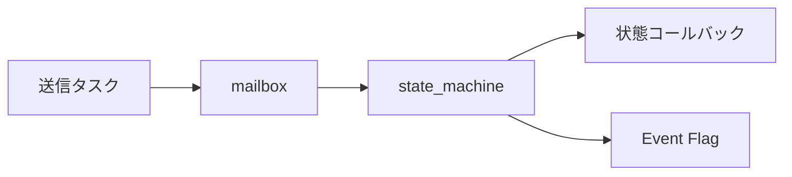

# RTOSイベント駆動ステートマシン 設計

## 概要

- 状態: 実装済み
- 対応Issue: #68, #72
- 目的: mailboxのイベントを現在状態のコールバックへ配送し、状態遷移をEvent Flagで通知する。

## 責務と依存関係



## 公開インターフェース

```c
typedef struct { uint32_t id; uintptr_t parameter; } state_machine_event_t;
typedef error_code_t (*state_machine_callback_t)(void *context,
                                                  state_machine_state_t current_state,
                                                  const state_machine_event_t *event,
                                                  state_machine_state_t *next_state);
error_code_t state_machine_init(/* ... */);
error_code_t state_machine_process_next(state_machine_t *machine, uint32_t timeout_ms);
error_code_t state_machine_current_state(const state_machine_t *machine,
                                         state_machine_state_t *state);
```

送信側は`state_machine_event_t`をmailboxへ送る。`state_machine_process_next`は1件受信して現在状態のコールバックを実行し、状態遷移時だけ指定Event Flagをセットする。状態ハンドラ配列は呼び出し側が静的に所有する。全APIと状態コールバックは`error_code_t`を返し、下位APIまたはコールバックの失敗コードはそのまま呼び出し元へ伝播する。

## 検証方法

- Debugファームウェアをビルドし、FreeRTOSを直接利用するmailboxおよびEvent Flagとともにコンパイルできることを確認する。
