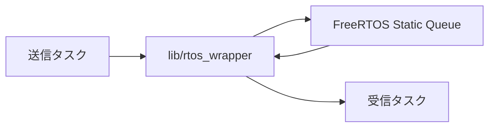
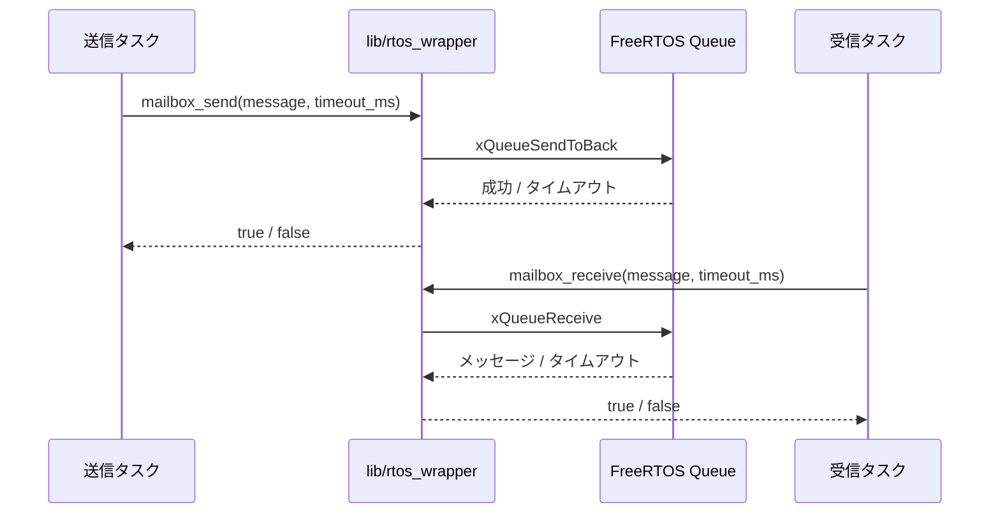

# RTOSメールボックス設計

## 概要

- 状態: 実装済み
- 対応Issue: #43
- 目的: FreeRTOSタスク間で固定長メッセージを安全に受け渡す共通メールボックスを提供する。
- 背景: Runtimeアーキテクチャで定義したコマンド、返信および状態通知のQueueを、静的確保の共通APIで扱えるようにする。

## スコープ

### 対象

- 静的確保したFreeRTOS Queueの初期化、送信、受信および格納済みメッセージ数の取得
- 固定長メッセージ型とメールボックス容量を呼び出し側が指定するAPI

### 対象外

- 可変長メッセージ、優先度付きメッセージ、ブロードキャスト
- ISRからの送受信
- 個別タスクやRuntimeアーキテクチャで定義したQueueの生成

## 責務と依存関係



- `lib/rtos_wrapper/mailbox`は、静的に確保されたFreeRTOS Queueを用いるメールボックスを提供する。
- 呼び出し側は`mailbox_t`と、メッセージ型のサイズ×容量分の格納領域を静的に保持する。
- FreeRTOSは本プロジェクトの固定依存であり、`mailbox_t`はFreeRTOSのQueue型を内部に保持する。

## 公開インターフェース

```c
typedef struct {
    QueueHandle_t handle;
    StaticQueue_t queue_buffer;
} mailbox_t;

bool mailbox_init(mailbox_t *mailbox, void *storage,
                  size_t capacity, size_t item_size);
bool mailbox_send(mailbox_t *mailbox, const void *message, uint32_t timeout_ms);
bool mailbox_receive(mailbox_t *mailbox, void *message, uint32_t timeout_ms);
size_t mailbox_message_count(const mailbox_t *mailbox);
```

- `mailbox_send`と`mailbox_receive`は、指定したミリ秒の待機時間内に操作できた場合だけ`true`を返す。
- `mailbox_message_count`は未初期化時に0を返す。
- `mailbox_init`は無効な引数およびFreeRTOSが表現できない容量・要素サイズで`false`を返す。呼び出し側は`storage`に少なくとも`capacity * item_size`バイトの静的領域を渡す。
- メールボックスと格納領域は、利用するすべてのタスクより長く存続させる。

## 処理フロー



## RTOS・ハードウェア上の考慮

- 実行コンテキスト: タスクのみ。ISRからは使用しない。
- FreeRTOS Heapを使用せず、`xQueueCreateStatic`でQueue制御領域とメッセージ格納領域を静的に確保する。
- タイムアウトは呼び出し側がミリ秒で決定する。低遅延処理では`0`、失ってはならないコマンドでは適切な待機時間を指定する。
- メールボックスはミリ秒からtickへの変換を64bit演算で行う。結果が有限待機として表現できる最大値以上になる場合は、`portMAX_DELAY - 1` tickへ飽和させる。

## 検証方法

- Debugファームウェアをビルドし、FreeRTOSの静的Queue APIを含めてコンパイルできることを確認する。
- 既存のホスト単体テストをすべて実行する。

## 未決定事項

- 個別のRuntime Queueで使用するメッセージ型、容量およびタイムアウトは、各タスクの実装時に決定する。
