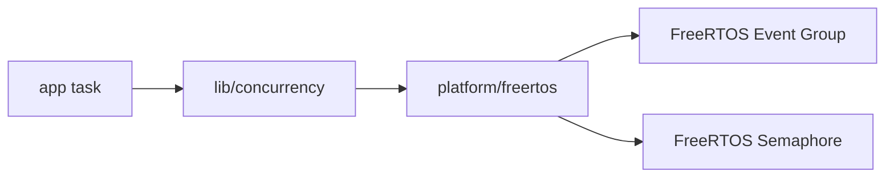
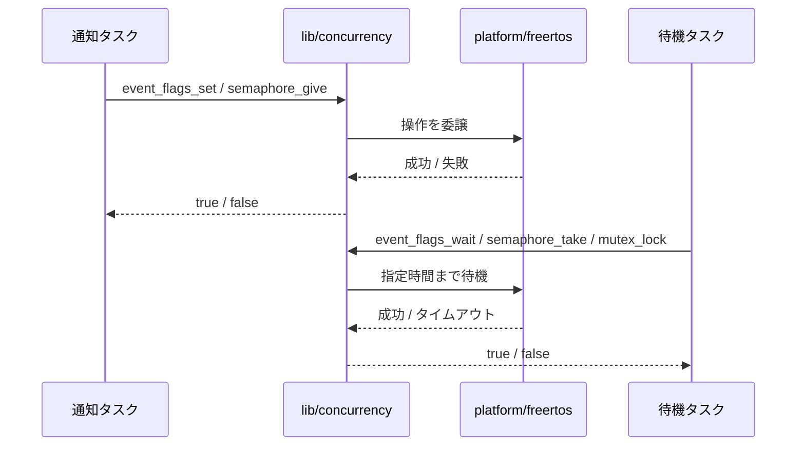

# RTOS同期機能 設計

## 概要

- 状態: 実装済み
- 対応Issue: #66
- 目的: タスク間の状態通知、通知数の管理、共有資源の排他を、FreeRTOSに直接依存しない共通APIで提供する。
- 背景: mailboxだけでは、メッセージ本体を伴わない複数状態の通知や共有資源の排他を表現できない。

## スコープ

### 対象

- Event Flagによるビット状態の設定、消去、取得、待機
- counting semaphore（binary semaphoreを含む）による通知と待機
- 優先度継承を行うmutexによるロックとアンロック
- 静的確保したFreeRTOS Event GroupおよびSemaphoreによる実装

### 対象外

- ISRからの状態設定、通知、ロック、アンロック
- recursive mutex、reader-writer lock、条件変数
- オブジェクトの破棄と動的メモリ割り当て

## 責務と依存関係



- `lib/concurrency`はRTOS非依存の抽象API、無効な引数の検出、共通の型を提供する。
- `platform/freertos`は抽象APIをFreeRTOSの静的オブジェクトへ接続する。
- `app`は`event_flags_t`、`semaphore_t`、`mutex_t`だけを使用し、FreeRTOS APIを直接使用しない。

## 公開インターフェース

```c
#define EVENT_FLAGS_USER_BITS_MASK UINT32_C(0x00ffffff)
typedef uint32_t event_flags_bits_t;

bool event_flags_set(event_flags_t *event_flags, event_flags_bits_t bits);
bool event_flags_clear(event_flags_t *event_flags, event_flags_bits_t bits);
bool event_flags_wait(event_flags_t *event_flags, event_flags_bits_t bits,
                      bool wait_all, bool clear_on_exit, uint32_t timeout_ms,
                      event_flags_bits_t *observed_bits);
event_flags_bits_t event_flags_get(const event_flags_t *event_flags);

bool semaphore_give(semaphore_t *semaphore);
bool semaphore_take(semaphore_t *semaphore, uint32_t timeout_ms);

bool mutex_lock(mutex_t *mutex, uint32_t timeout_ms);
bool mutex_unlock(mutex_t *mutex);

bool freertos_event_flags_init(freertos_event_flags_t *event_flags);
event_flags_t *freertos_event_flags_handle(freertos_event_flags_t *event_flags);

bool freertos_semaphore_init(freertos_semaphore_t *semaphore,
                             size_t maximum_count, size_t initial_count);
semaphore_t *freertos_semaphore_handle(freertos_semaphore_t *semaphore);

bool freertos_mutex_init(freertos_mutex_t *mutex);
mutex_t *freertos_mutex_handle(freertos_mutex_t *mutex);
```

- Event Flagの利用可能なビットは`EVENT_FLAGS_USER_BITS_MASK`で示す下位24ビットだけであり、`0`や範囲外のビットを指定した操作は失敗する。
- `event_flags_wait`は、`wait_all`が`true`なら全ビット、`false`ならいずれか1ビットを待機する。戻り値は待機条件を満たした場合だけ`true`であり、待機終了時点のビット状態を`observed_bits`へ返す。`clear_on_exit`が`true`の場合は、条件を満たしたビットをFreeRTOSが消去する。
- `freertos_semaphore_init`で`maximum_count`を`1`にするとbinary semaphoreとして利用できる。`initial_count`は`maximum_count`以下かつ、`maximum_count`は0より大きくなければならない。
- mutexは作成時に解放済みであり、所有タスクだけが`mutex_unlock`を呼び出せる。FreeRTOS実装は優先度継承を提供する。
- `*_handle`は、対応する`*_init`が成功した後にだけ呼び出せる。その条件で初期化済みオブジェクトの抽象ハンドルを返す。未初期化のCオブジェクトを検査して安全に扱うことはできないため、`*_init`前に呼び出してはならない。
- `event_flags_t`、`semaphore_t`、`mutex_t`の内部フィールドは初期化後に変更しない。

## 処理フロー



## RTOS・ハードウェア上の考慮

- 実行コンテキスト: タスクのみ。ISRからは呼び出さない。
- FreeRTOSオブジェクトは`freertos_event_flags_t`、`freertos_semaphore_t`、`freertos_mutex_t`の内部バッファを使って静的に確保し、Heapを使用しない。
- タイムアウトはミリ秒で指定する。有限待機として表現できる最大tick以上は`portMAX_DELAY - 1` tickへ飽和させる。
- 各オブジェクトは静的記憶域期間で確保し、それを利用するすべてのタスクより長く存続させる。初期化と利用を並行させず、`*_init`が`true`を返した後にだけ`*_handle`および抽象APIを使用する。
- mutexを保持したままブロッキングI/Oや長時間処理を行わない。

## 検証方法

- ホスト単体テストで各抽象APIの委譲と無効引数の扱いを確認する。
- Debugファームウェアをビルドし、FreeRTOSの静的 Event Group と Semaphore API を含めてコンパイルできることを確認する。
