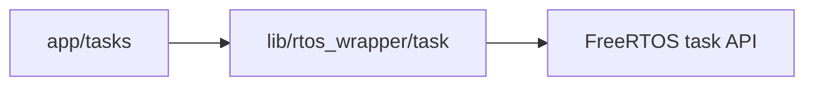
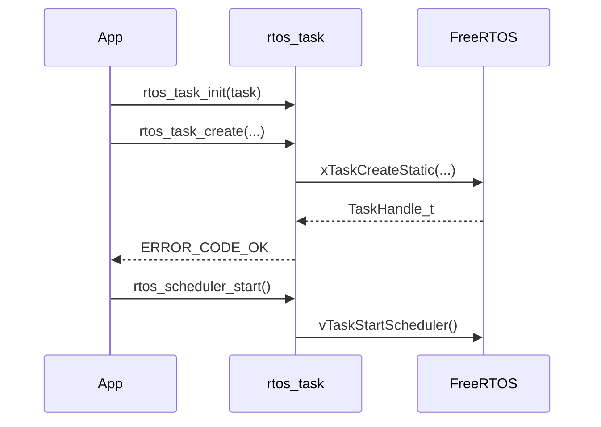

# RTOSタスク管理ラッパー 設計

## 概要

- 状態: 実装済み
- 対応Issue: #76
- 目的: FreeRTOSの静的タスク生成、スケジューラ開始およびタスク削除を共通APIで提供する。
- 背景: タスク制御領域の静的確保と、引数・ライフサイクルの検証をアプリケーション実装から分離する。

## スコープ

### 対象

- `rtos_task_t`の初期化、静的タスク生成、スケジューラ開始および他タスクの削除
- 無効な引数、重複生成、未生成タスクの削除の検出

### 対象外

- 動的タスク生成
- ISRからのタスク生成・削除
- 自己削除
- タスク通知、待機、優先度変更

## 責務と依存関係



- `lib/rtos_wrapper/task`は、呼び出し側が所有するスタック領域と内部の静的TCBを用いてタスクを作成する。
- `app`はタスク関数、名前、優先度、引数およびスタック領域を指定する。
- モジュールはFreeRTOSの`task.h`と共通の`error_code.h`に依存する。

## 公開インターフェース

```c
typedef void (*rtos_task_entry_t)(void *parameter);

typedef struct {
    TaskHandle_t handle;
    StaticTask_t task_buffer;
} rtos_task_t;

error_code_t rtos_task_init(rtos_task_t *task);
error_code_t rtos_task_create(rtos_task_t *task,
                              rtos_task_entry_t entry,
                              const char *name,
                              StackType_t *stack_buffer,
                              size_t stack_depth,
                              void *parameter,
                              UBaseType_t priority);
error_code_t rtos_scheduler_start(void);
error_code_t rtos_task_delete(rtos_task_t *task);
```

- `rtos_task_init`は制御領域を未生成状態へ初期化する。生成済みタスクに対して呼び出してはならない。
- `rtos_task_create`は`xTaskCreateStatic`を呼び出す。同一の`rtos_task_t`を重複して生成することはできない。
- `rtos_scheduler_start`は`vTaskStartScheduler`を呼び出す。正常に開始した場合は復帰しない。復帰した場合は`ERROR_CODE_NOT_READY`を返す。
- `rtos_task_delete`は、スケジューラ実行中は他タスクだけを削除できる。スケジューラ開始前の削除は許可し、実行中に自身を削除しようとした場合は`ERROR_CODE_UNSUPPORTED`を返す。

## 処理フロー



## RTOS・ハードウェア上の考慮

- 実行コンテキスト: 初期化・生成・開始・削除はタスク文脈またはスケジューラ開始前の文脈で使用する。ISRからは呼び出さない。
- メモリとスタック: TCBは`rtos_task_t`内に静的確保する。スタックは呼び出し側が静的領域として所有し、要素数を`StackType_t`単位で指定する。
- 同期: 作成・削除と`rtos_task_t`へのアクセスは呼び出し側が直列化する。

## 検証方法

- ホスト単体テストで、引数検証、生成、重複生成、削除、自己削除拒否およびスケジューラ開始失敗時の結果を確認する。
- Debugファームウェアをビルドし、FreeRTOS静的タスクAPIとのリンクを確認する。
