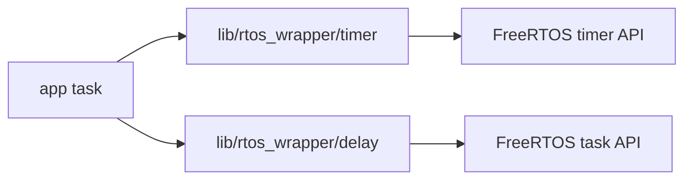
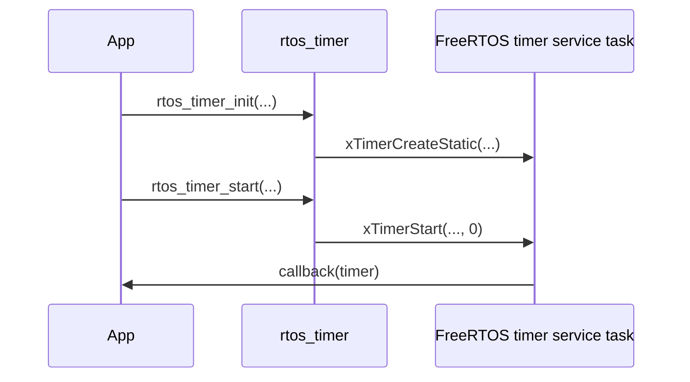

# RTOSタイマー・delayラッパー 設計

## 概要

- 状態: 実装済み
- 対応Issue: #78
- 目的: FreeRTOSのソフトウェアタイマーおよびタスク待機を、静的確保と共通の`error_code_t`で利用できるようにする。
- 背景: アプリケーションからFreeRTOS APIの型、単位変換および引数検証を分離する。

## スコープ

### 対象

- 静的確保した一回実行・周期実行ソフトウェアタイマーの初期化、開始、停止およびリセット
- ミリ秒単位の相対待機
- 周期実行用の基準時刻の初期化および周期待機

### 対象外

- 動的に確保するソフトウェアタイマー
- ISRからのタイマー操作および待機
- タイマーの周期変更、削除、コールバック内での再設定

## 責務と依存関係



- `rtos_timer`は、呼び出し側が所有する`rtos_timer_t`内の静的制御領域を使ってソフトウェアタイマーを管理する。
- `rtos_delay`は、ミリ秒をFreeRTOS tickへ変換して現在タスクを待機させる。
- アプリケーションはコールバック関数と任意のコンテキストを所有する。

## 公開インターフェース

```c
typedef struct {
    TimerHandle_t handle;
    StaticTimer_t timer_buffer;
} rtos_timer_t;

error_code_t rtos_timer_init(rtos_timer_t *timer,
                             const char *name,
                             uint32_t period_ms,
                             bool auto_reload,
                             TimerCallbackFunction_t callback,
                             void *context);
error_code_t rtos_timer_start(rtos_timer_t *timer);
error_code_t rtos_timer_stop(rtos_timer_t *timer);
error_code_t rtos_timer_reset(rtos_timer_t *timer);

typedef struct { TickType_t last_wake_time; } rtos_periodic_delay_t;

error_code_t rtos_delay_ms(uint32_t delay_ms);
error_code_t rtos_periodic_delay_init(rtos_periodic_delay_t *delay);
error_code_t rtos_periodic_delay_wait(rtos_periodic_delay_t *delay, uint32_t period_ms);
```

- `rtos_timer_init`はタイマーを休止状態で初期化する。期間は1 ms以上とし、`callback`と`name`は必須とする。
- `rtos_timer_start`、`rtos_timer_stop`および`rtos_timer_reset`は、タイマーサービス・タスクへのコマンド送信を待たない。
- `rtos_delay_ms`は相対待機を、`rtos_periodic_delay_wait`は`vTaskDelayUntil`による基準時刻からの周期待機を行う。
- 無効なポインターは`ERROR_CODE_INVALID_ARGUMENT`、0 msやtickへ変換できない期間は`ERROR_CODE_OUT_OF_RANGE`、タイマーコマンドの送信失敗は`ERROR_CODE_NOT_READY`で報告する。

## 処理フロー



## RTOS上の考慮

- タイマーの開始・停止・リセットはタスク文脈で呼び出す。ISRでは使用しない。
- タイマーコールバックはタイマーサービス・タスクで実行される。ブロッキング処理、長時間処理、重いI/Oは実行せず、必要な処理は通知またはメールボックスで別タスクへ渡す。
- `rtos_periodic_delay_t`は待機するタスクごとに1個を所有し、複数タスクから共有しない。
- タイマー制御領域は`rtos_timer_t`内で静的に確保し、動的メモリを使用しない。

## 検証方法

- ホスト単体テストで、引数検証、静的タイマー生成、開始・停止・リセットの失敗、相対待機および周期待機を確認する。
- Debugファームウェアをビルドし、FreeRTOSのtimer APIおよびtask APIとリンクできることを確認する。
