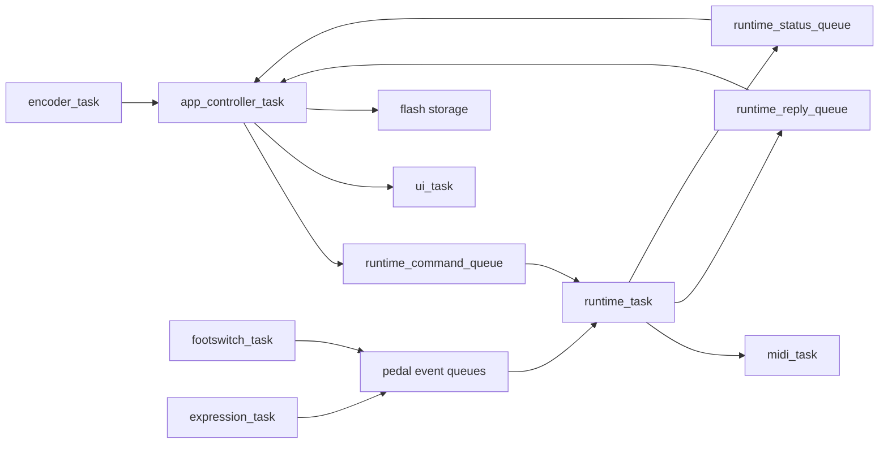
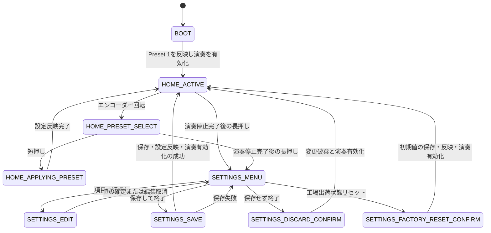

# Runtimeアーキテクチャ設計

## 概要

- 状態: 確定
- 対応Issue: #39
- 目的: 演奏時の低遅延なペダル処理と、設定・保存・UIを分離する。現行の単一コア実装から、将来のRP2040デュアルコア構成へ移行可能な境界を定義する。

## スコープ

### 対象

- `BOOT`、`HOME`、`SETTINGS`の状態遷移
- `app_controller`と`runtime`の責務、イベント、コマンドおよび状態通知
- タスク、Queue、優先度および将来のコア配置
- プリセット、本体設定、実行状態およびFlash保存方針
- OLEDをI2C0、入力デバイスをI2C1へ分離する方針

### 対象外

- FreeRTOSのSMP対応方式、コア起動APIおよびスタック量の実装詳細
- OLEDのピクセル単位のレイアウト
- フットスイッチのデバウンス時間、EXPのデッドバンド値

## 責務と依存関係



- `app_controller_task`は状態機械、編集用設定、保存済み設定、プリセット候補およびUIモデルを所有する。
- `runtime_task`は有効化済みの実行設定コピーと、現在PC番号、CC状態、EXP値を所有する。
- 入力タスク、MIDIタスク、UIタスクおよびドライバは、上記の状態を直接変更しない。
- `lib`はプリセット検証、デバウンス、エンコーダー判定、MIDIマッピングを担当し、FreeRTOSおよびPico SDKに依存しない。

## 状態遷移



`SETTINGS`へ入る前に、App Controllerは`DISABLE_PERFORMANCE`を送信し、同じ`request_id`を持つ停止完了返信を待つ。返信を受けるまで設定画面を表示しない。設定中にペダルイベントを受けても、RuntimeはMIDIメッセージを生成しない。

## タスクとQueue

| タスク | 責務 | 相対優先度 | 将来の配置 |
| --- | --- | --- | --- |
| `expression_task` | ADS1015の変換完了処理、EXP値の正規化 | 高 | core1 |
| `runtime_task` | ペダルイベントの解釈、実行状態の更新 | 高 | core1 |
| `midi_task` | USB保守、USB/DIN MIDI送信 | 高 | core1 |
| `footswitch_task` | MCP23017読取り、デバウンス | 中 | core1 |
| `encoder_task` | 回転、短押し、長押しの判定 | 中 | core0 |
| `app_controller_task` | 状態機械、設定、保存、UIモデル | 中 | core0 |
| `ui_task` | OLEDおよびRGB LEDの更新 | 低 | core0 |

現行は単一コアでこれらを実行する。将来は制御系をcore0、実行系をcore1へ配置する。OLEDをI2C0へ分離し、core0のUI処理とcore1の入力処理がI2Cバスを共有しない構成とする。

| Queue | 長さ | 方針 |
| --- | ---: | --- |
| `encoder_event_queue` | 8 | 回転は集約し、短押し・長押しを優先する。 |
| `footswitch_event_queue` | 12 | デバウンス済みの押下・解放を保持する。 |
| `expression_value_queue` | 1 | 常に最新の値で上書きする。 |
| `runtime_command_queue` | 4 | コマンドを破棄しない。 |
| `runtime_reply_queue` | 4 | 設定反映・演奏停止などの完了確認を破棄しない。 |
| `runtime_status_queue` | 1 | 最新の実行状態スナップショットで上書きする。 |
| `ui_update_queue` | 1 | 最新のUIモデルで上書きする。 |

## 公開データ型と通信

```c
typedef enum {
    ENCODER_EVENT_ROTATED,
    ENCODER_EVENT_SHORT_PRESSED,
    ENCODER_EVENT_LONG_PRESSED,
} encoder_event_type_t;

typedef struct {
    encoder_event_type_t type;
    int8_t direction;
} encoder_event_t;

typedef enum {
    PEDAL_EVENT_SWITCH_PRESSED,
    PEDAL_EVENT_SWITCH_RELEASED,
    PEDAL_EVENT_EXPRESSION_CHANGED,
} pedal_event_type_t;

typedef struct {
    pedal_event_type_t type;
    uint8_t switch_index;
    uint8_t expression;
} pedal_event_t;

typedef enum {
    RUNTIME_COMMAND_SET_CONFIG,
    RUNTIME_COMMAND_ENABLE_PERFORMANCE,
    RUNTIME_COMMAND_DISABLE_PERFORMANCE,
} runtime_command_type_t;
```

`runtime_command_t`はコマンド種別、`request_id`および`SET_CONFIG`用の`runtime_config_t`を持つ。`runtime_config_t`はプリセット番号、プリセット1件、本体共通設定のコピーからなる。Runtimeは設定構造体を共有参照しない。

Runtimeは、`CONFIG_APPLIED`、`PERFORMANCE_ENABLED`、`PERFORMANCE_DISABLED`、`ERROR`を`request_id`付きで返信する。UI向けには、現在PC番号、CCトグル状態、モーメンタリー状態、EXP値および送信エラーを含むスナップショットを通知する。EXP表示の通知は最大30 Hzとする。

MIDIマッピングはハードウェア非依存の`lib/midi`に配置する。中心APIは次の形とする。

```c
bool midi_mapping_apply(
    const runtime_config_t *config,
    runtime_state_t *state,
    const pedal_event_t *event,
    midi_message_t *message);
```

この関数は実行状態を更新し、送信すべきPCまたはCCがある場合だけ`true`を返す。Runtimeは演奏有効時だけこの関数を呼ぶ。

## データと保存

`preset_t`は初期PC番号、6個のフットスイッチ割り当て、EXPのCC番号、MIDI最小・最大値、ADCキャリブレーション最小・最大値を持つ。フットスイッチ動作はPC絶対指定、PC Next、PC Previous、CCトグル、CCモーメンタリーのいずれかとする。本体共通設定はMIDIチャンネルと出力先（USB、DIN、両方）だけを持つ。

プリセット有効化時には、現在PC番号を初期PC番号へ戻し、CCトグルをOFF、モーメンタリーを解放状態へ戻す。EXPは現在位置を表示するが、プリセット確定だけでMIDIは送信しない。電源投入時は常にPreset 1を有効化し、MIDIは自動送信しない。

安全な初期値は、MIDIチャンネル1、出力先USB、初期PC番号0、6個のフットスイッチすべてPC絶対指定のProgram 0、EXPのCC番号11およびMIDI範囲0〜127とする。EXPのADCキャリブレーション初期範囲は0〜2047とし、実機でのキャリブレーションを推奨する。

Flashには本体設定と10個のプリセットだけを保存する。現在選択中のプリセット、現在PC番号、CC状態、EXP値は保存しない。保存レコードは`magic`、フォーマットバージョン、世代番号、ペイロード長、CRC32およびペイロードから構成し、2スロットへ交互に書き込む。起動時はCRCが正しい最も新しい世代を選び、両方無効または未対応形式なら安全な初期値を使う。

保存は`SETTINGS`での「保存して終了」または工場出荷状態リセット時だけに行う。保存失敗時は古い有効レコードを維持し、編集用コピーを残したまま設定メニューへ戻る。

## 設定メニュー

```text
Preset Settings
├─ Select Preset 1〜10
├─ Initial PC Number
├─ Footswitch 1〜6
└─ Expression
   ├─ CC Number
   ├─ MIDI Minimum / Maximum
   └─ Calibrate Minimum / Maximum
Device Settings
├─ MIDI Channel
└─ MIDI Output: USB / DIN / BOTH
Save and Exit
Discard Changes
Factory Reset
```

回転で項目または値を選び、短押しで選択または確定する。編集中の長押しはその項目を取り消して親メニューへ戻る。最上位メニューでの長押しは保存せず終了の確認へ進む。キャリブレーションは最小位置、最大位置でそれぞれ短押ししてADC値を記録し、最小値が最大値以上となる結果は受け付けない。

## 検証方法

- `lib`のホスト単体テストで、MIDIマッピング、PC番号循環、CC状態、設定値検証および保存レコードのCRC判定を確認する。
- FreeRTOS実装後、設定遷移で`DISABLE_PERFORMANCE`完了前に設定画面へ入らないことを確認する。
- 実機で、OLEDのI2C0通信とADS1015・MCP23017のI2C1通信が独立して動作することを確認する。
