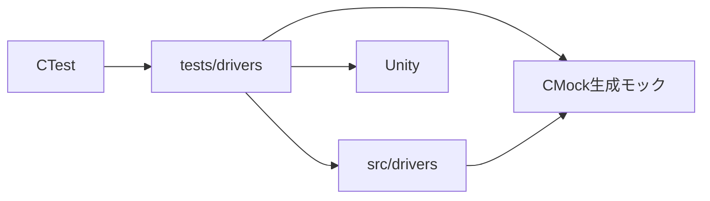

# ホスト単体テスト設計

## 背景

- 種別: ビルド・検証設計
- 対象Issue: #35
- 対象範囲: ファームウェアモジュールに対するホスト実行の単体テスト

## 目的

- RP2040基板なしで、開発PC上の決定的な単体テストを実行する。
- ファームウェアのARMクロスビルドと、ホストテストのビルドを分離する。
- 生成したモックを通じて、Pico SDK APIに対するドライバの呼び出しを検証する。

## 構成

- Unityがテストの実行とアサーションを提供する。
- CMockはビルド時に`tests/mocks/`配下のヘッダからモックを生成する。生成物は
  ビルドディレクトリだけに配置し、バージョン管理しない。
- テスト専用の置換ヘッダは、対象モジュールに必要な外部インターフェースを模倣する。
  これにより、ホストテストはPico SDKヘッダを読み込まない。

## ビルドの分離

`debug`および`release`プリセットはRP2040ファームウェアをビルドする。
`host-tests`プリセットは`USB_MIDI_PEDAL_BUILD_FIRMWARE=OFF`を設定してCTestを
有効にし、ネイティブコンパイラでホスト実行ファイルをビルドする。CIはこの
プリセットでビルドしてからCTestを実行する。

## 初期カバレッジ

`rgb_led_test`は初期化、色設定、toggle操作におけるactive-low GPIO出力をテストする。
以降のドライバテストでは、この構成を参照パターンとする。
