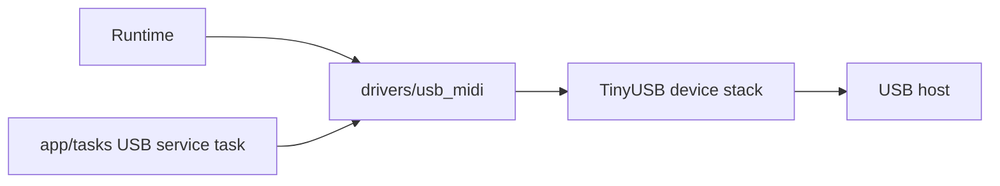
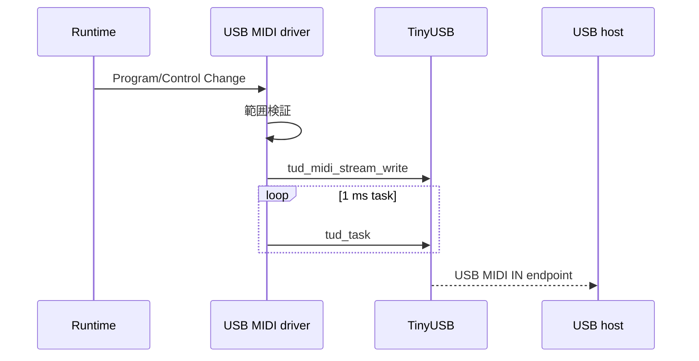

# USB MIDIドライバ設計

## 概要

- 状態: 実装済み
- 対応Issue: #23
- 目的: Tiny 2040をUSB MIDI 1.0デバイスとして認識させ、演奏機能からProgram ChangeとControl Changeを送信できるようにする。
- 背景: 製品要件のUSB MIDI OUTを満たすため、TinyUSBを使用する。

## スコープ

### 対象

- USB MIDI 1.0デバイス用のTinyUSB記述子と初期化
- Program ChangeおよびControl Changeの送信
- TinyUSBイベント処理を実行するFreeRTOSタスク

### 対象外

- MIDI IN、MIDI THRU、USB MIDIからDIN MIDIへのスルー
- MIDIメッセージのマッピングおよび送信スケジューリング
- USB CDCログの送受信処理

## 責務と依存関係



- `drivers/usb_midi/`はUSB MIDIの初期化、記述子、およびMIDIメッセージをTinyUSBの送信バッファへ渡す責務を持つ。
- `app/tasks/usb_midi_task.c`の専用タスクが`usb_midi_service()`を周期実行する。
- 呼び出し側はメッセージの送信時機と再試行を管理する。

## 公開インターフェース

```c
bool usb_midi_init(void);
void usb_midi_service(void);
bool usb_midi_is_connected(void);
bool usb_midi_send_program_change(uint8_t channel, uint8_t program);
bool usb_midi_send_control_change(uint8_t channel, uint8_t controller, uint8_t value);
```

- `channel`は0から15、Program Changeの`program`、Control Changeの`controller`と`value`は0から127を受け付ける。
- 値が範囲外の場合、またはTinyUSBの送信バッファへ全バイトを書き込めない場合は`false`を返す。
- `usb_midi_service()`はタスク文脈からのみ呼び出し、ISRからは呼び出さない。

## 処理フロー



## RTOS・ハードウェア上の考慮

- TinyUSBはPico SDK構成で初期化し、USB MIDI送信バッファは64 byteに固定する。
- USBはMIDIとCDCの複合デバイスとして列挙される。`LOG_OUTPUT=USB_CDC`を選ぶと、CDCを診断ログ出力に使用する。
- USBデバイス記述子はIAD複合デバイスのクラス値を使用し、PIDはCDCとMIDIの複合構成を示す`0x4009`とする。
- 送信関数はブロックしない。送信バッファ満杯時は`false`を返す。

## 検証方法

- Debugビルドが成功すること。
- ホスト単体テストで、送信するMIDIメッセージ、入力値検証、および既存の全テストが成功すること。
- 実機でPCにUSB MIDIデバイスとして認識され、Program ChangeとControl Changeを受信できること。
  2026-09-12にWeb MIDI APIで、`USB MIDI Pedal`の入出力ポート認識、チャネル1の
  Program Change 0（`C0 00`）およびControl Change 1、値64（`B0 01 40`）の受信を確認した。
