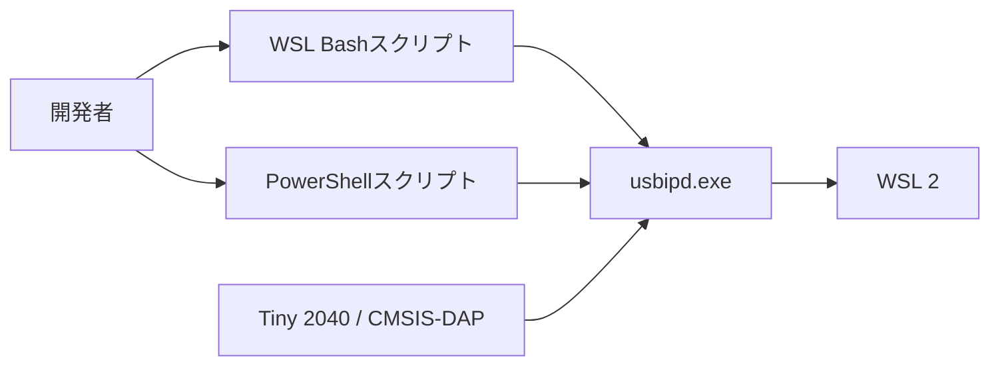
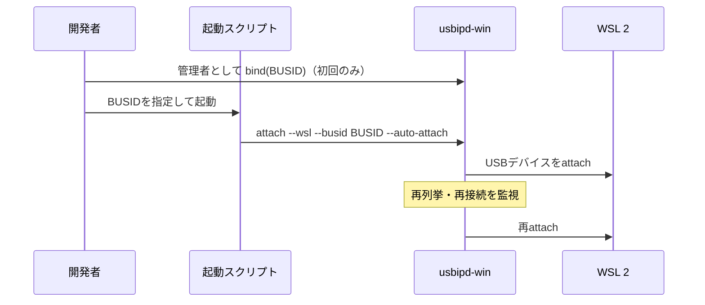

# WSL USB自動attach 設計

## 概要

- 状態: 実装済み
- 対応Issue: #60
- 目的: Tiny 2040本体およびCMSIS-DAPデバッグプローブが再列挙または再接続された際に、WSL 2へのUSB attachを継続して行う。
- 背景: WSLではUSBデバイスの再列挙ごとに手動attachが必要となり、書き込みとデバッグの開発手順が中断される。

## スコープ

### 対象

- 指定した`BUSID`に対する`usbipd-win`のWSL auto-attach開始。
- Windows PowerShellおよびWSL Bashからの監視プロセス起動。
- BOOTSEL、USB CDC、CMSIS-DAPとして再列挙するTiny 2040関連デバイス。

### 対象外

- Windows管理者権限が必要な`usbipd bind`の自動実行。
- USBデバイスの検出、BUSIDの選択、またはファームウェアの書き込み。
- WSL以外の仮想化環境へのUSB転送。

## 責務と依存関係



- `tools/start-wsl-usb-auto-attach.ps1`: Windows上で`usbipd attach --wsl --auto-attach`を開始する。
- `tools/start-wsl-usb-auto-attach.sh`: WSLからWindows側の`usbipd.exe`を見つけ、同じ監視を開始する。
- `usbipd-win`: 共有済みUSBデバイスをWSLへ転送し、再列挙後も指定BUSIDを監視する。
- 利用者: WSLでpicotool、OpenOCD、USB CDCを利用する開発者。

## 公開インターフェース

```text
tools/start-wsl-usb-auto-attach.ps1 -BusId <BUSID>
tools/start-wsl-usb-auto-attach.sh <BUSID>
```

- 入力: `usbipd list`で確認した`BUSID`。
- 出力: `usbipd`の監視・attach状態の標準出力とエラー出力。
- エラー処理: `BUSID`未指定、`usbipd.exe`未検出、未共有デバイスなどの`usbipd`エラーを呼び出し元へ返す。
- ライフサイクル: 監視プロセスはターミナルを開いている間だけ動作し、`Ctrl+C`で停止する。

## 処理フロー



## 検証方法

- スクリプト構文: `bash -n tools/start-wsl-usb-auto-attach.sh`。
- 実機確認: 共有済みの対象BUSIDに対しスクリプトを起動し、抜き差しまたは再列挙後に`usbipd list`とWSL内のデバイス表示を確認する。
- 期待結果: 監視中に対象デバイスがWSLへ再attachされ、手動の`usbipd attach`なしにpicotoolまたはOpenOCDを利用できる。

## 未決定事項

- 同一物理デバイスの再列挙でBUSIDが変化する環境への対応は、`usbipd-win`の動作仕様を確認して必要になった場合に検討する。
