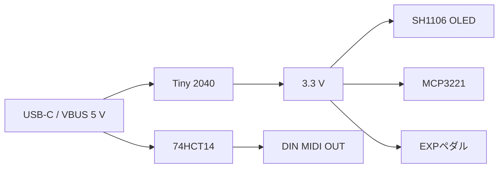

# ハードウェア仕様

## 概要

- 状態: 確定（電気仕様）
- 対応Issue: #15
- 対象: USB MIDI Pedalの電源、入出力回路、主要部品およびGPIO使用方針

本書は、製品要件を満たすために確定した電気仕様を記録する。GPIO番号の詳細は[ピン割り当て](pin_assignment.md)、I2C ADCの選定経緯は[ADC選定](designs/adc-selection.md)を参照する。

## 電源

- 電源入力はTiny 2040基板上のUSB-C端子のVBUS（5 V）のみとする。
- 外部9 Vペダル電源および電池には対応しない。
- USB Power Deliveryなどの電源交渉は行わない。
- Tiny 2040の3.3 Vレギュレータ出力を、GPIO、I2Cバス、SH1106 OLED、MCP3221およびEXPペダルの励起電圧に使用する。
- USBの5 Vは74HCT14とDIN MIDI OUTの電流ループにのみ使用する。

## 表示・入力・出力

| 機能 | 確定仕様 |
| --- | --- |
| OLED | 1.3インチ、128×64、SH1106、I2C、3.3 V |
| フットスイッチ | 2端子、ノーマリーオープン（NO）、モーメンタリーを6個。スイッチ内蔵LEDは使用しない。 |
| ロータリーエンコーダー | 機械式インクリメンタル方式、A相・B相・押しボタンを使用する。 |
| EXP入力 | 6.35 mm TRSジャックを1個使用する。Tipはワイパー、Ringは3.3 V、SleeveはGNDとする。 |
| USB MIDI | Tiny 2040のUSB-C端子を使用する。USB MIDI OUTを提供する。 |
| DIN MIDI | 5ピンDINのMIDI OUT専用とする。MIDI IN、THRU、USBからDINへのスルーは提供しない。 |

### フットスイッチとエンコーダーの入力回路

- フットスイッチとエンコーダーの各接点は、GPIOをGNDへ落とすactive-low入力とする。
- 各フットスイッチ入力は、3.3 Vへの10 kΩ外部プルアップ、1 kΩ直列抵抗およびGNDへの100 nFコンデンサを備える。
- エンコーダーA相、B相および押しボタンは3.3 Vプルアップ入力とし、ソフトウェアでデバウンスする。
- フットスイッチもソフトウェアでデバウンスする。誤検出防止を操作遅延より優先する。

### EXP入力とADC

- MCP3221A5T-I/OTを使用する。SOT-23-5の12 bit、単一エンドI2C ADCである。
- ADC、EXPペダルおよびI2C信号は3.3 V系で動作させる。
- EXPワイパーとADC入力の間には、保護用の直列抵抗とノイズ低減用コンデンサを配置する。値は実機でADC変換精度と応答性を確認して決定する。
- EXPは1 ms周期でサンプリングする。

### I2Cバス

- SH1106 OLEDとMCP3221は同じI2Cバスを共有する。
- バス速度は400 kHz（Fast-mode）、信号レベルは3.3 Vとする。
- MCP3221A5T-I/OTの7 bit I2Cアドレスは`0x4D`とする。SH1106 OLEDのアドレスは`0x3C`または`0x3D`に設定し、重複を避ける。
- SDA/SCLのプルアップは3.3 Vへ1組だけ配置する。モジュール側のプルアップを有効化する場合、基板側には重複して配置しない。

### DIN MIDI OUT

- Tiny 2040のUART TXを、5 Vで動作する74HCT14の2段へ接続し、5 V・非反転のUART信号に変換する。
- 74HCT14の出力と5 Vを、それぞれ220 Ω抵抗を介してDIN端子の5番・4番へ接続する。
- DIN端子の2番ピンはGNDへ接続しない。
- この回路は電圧レベル変換であり、ガルバニック絶縁ではない。MIDI OUT専用のため送信側にフォトカプラは設けない。

## GPIO使用方針

Tiny 2040の外部GPIO 12本をすべて使用する。割り当ては[ピン割り当て](pin_assignment.md)を参照する。追加の物理入力または出力が必要になった場合は、I2C GPIOエキスパンダーなどを追加する。

## 未決定事項

- フットスイッチ、ロータリーエンコーダー、DIN端子、TRSジャックおよびSH1106 OLEDモジュールの具体的な型番
- EXP入力の保護・平滑回路の部品定数
- OLEDの画面レイアウト、設定メニューの項目順およびRGB LEDの表示パターン
- 筐体内配線の長さと、それに応じた追加ESD保護の要否
