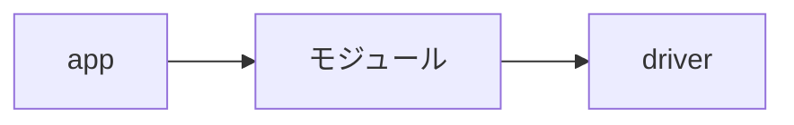
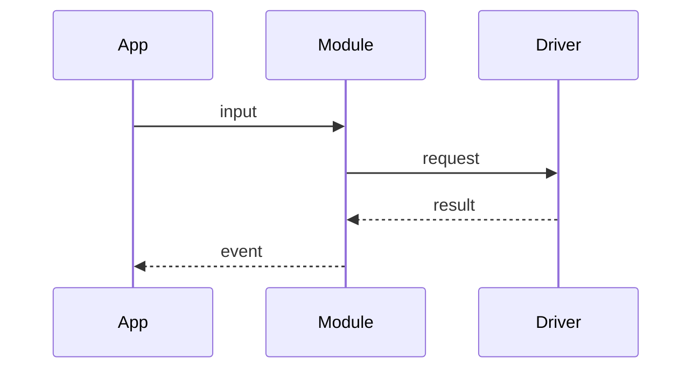

# 設計ドキュメントのテンプレート

新しい機能、モジュール、公開データ型、またはクラス相当の構造を実装する際は、次のテンプレートを基に`docs/designs/<機能名またはモジュール名>.md`を作成または更新します。ファイル名は小文字kebab-caseを使用します。

小規模な変更では「概要」「責務と依存関係」「公開インターフェース」「検証方法」を記載し、それ以外の項目は必要に応じて省略できます。

````markdown
# <機能名・モジュール名> 設計

## 概要

- 状態: 提案中 / 確定 / 実装済み
- 対応Issue: #<番号>
- 目的:
- 背景:

## スコープ

### 対象

- 

### 対象外

- 

## 要件

- 機能要件:
- 非機能要件: レイテンシ、メモリ、電力、信頼性など

## 責務と依存関係



- このモジュールの責務:
- 依存するモジュール:
- このモジュールを利用する側:

## 公開インターフェース

```c
// 主な公開型、関数、イベント
```

- 入力:
- 出力:
- エラー処理:
- 所有権・ライフサイクル:

## データ設計

- データ型:
- 永続化するデータ:
- 上限値・サイズ:

## 処理フロー



## RTOS・ハードウェア上の考慮

- 実行コンテキスト: タスク / ISR
- タスク、優先度、周期:
- Queue・通知:
- 使用GPIO、I2C、ADC、UARTなど:
- メモリとスタック:

## 検証方法

- 単体テスト:
- 実機確認:
- 期待結果:

## 未決定事項

- 
````
